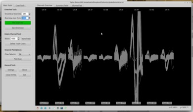
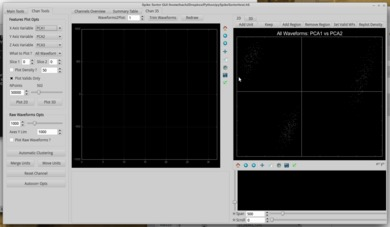
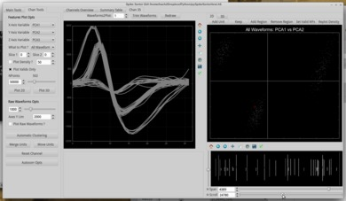
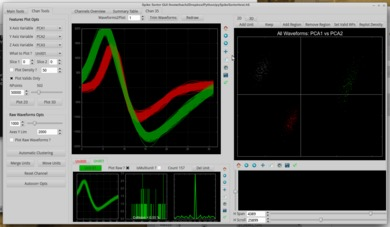
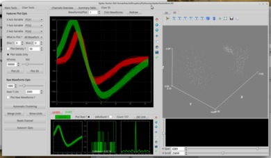

#pySpikeSorter
* A(nother) spike sorting utility capable of helping in the analisis of extracelullar action potential recordings.
* It is inspired by some of the features of the offline sorter software from plexon.
* It is intended to be a completely "Manual" solution for spike sorting (old school neurophysiologists don't like automated stuf,
 although there is some work to provide and/or interface with automatic clustering algorithms.
* It is far from being complete, but at this moment it is functional.
* I'm not a programmer, so I think there are lots of things that can be improved, that is why any comments aiming at improving it are welcome.

##Installation Instructions:  

###Requirements:
* Numpy
* Scipy
* Matplotlib
* PyQt4
* pyopengl
* guidata
* pyqtgraph
* pytables
* optional: Klustakwik

To meet all the requirements is important to have a working python installation.

In Debian based linux distributions i.e. **ubuntu** you can do:

```
sudo apt-get install python-numpy python-scipy python-tables python-guidata python-matplotlib
sudo apt-get install python-opengl python-qt4-gl
sudo pip install pyqtgraph
```

In **Windows** it is recomemnded to install a python bundle, for example [PythonXY](https://code.google.com/p/pythonxy/).

Under **MacOS** it is recommended to install the [Enthought](https://www.enthought.com/products/canopy/) package, which bundles most of the requirements.
If you do not want to install enthought, there are guides that can be used to succesfully install python in MAC: [link1](http://powernap.github.io/blog/2012/08/20/install-python-together-with-vtk-using-homebrew-for-mountain-lion/)
, [link2](http://docs.python-guide.org/en/latest/starting/install/osx/)

###Running pySpikeSorter:

There is no installation needed. Just download the files to a known location, and from the command line run:

```
cd /folder/that/contains/the/files
ipython -i pySpikeSorter.py
```

####Notes:
* It is not required to use ipython, but is more convenient if one wants to explore and intereact with the Spyke Sorter object.  


##Tutorial:
* A "test.h5" file is provided, which can be loaded in the appplication clicking on the green button.
* It should display an overview of the channels
* By clicking a particular channel it gets selected. Clicking the "Plot Chan" button plots the data in a specific Tab.
* Under that tab there are aeveral analisys and tools that can be used to sort the data.

###Video Tutorial:
in progress ...

##Screenshots:
[](screenshots/03.png)
[](screenshots/04.png)
[](screenshots/06.png)
[](screenshots/12.png)
[](screenshots/13.png)

##H5File Definition:
pySpikeSorter allows to sort spike events saved in an H5File.
The package [Neo](http://pythonhosted.org/neo/), makes possible to read data in various formats and transform those into an h5file.
The excellent package [Pytables](http://www.pytables.org/moin) provides a convenient way to create and manipulate these files.

To facilitate the process, a sample h5file with the basic structure is provided. You can examine the internal structure of the files
using the [viTables](http://vitables.org/) application.
The h5file basic structure is as follows:
* A group or folder called 'Spikes' (capital 'S')
* Inside, one grou/folder named 'Chan_000', where the zeros are replaced by the channel number. Note that the script asumes there are three integers.
* Inside each channel folder a:
    * 'Waveforms' numpy array, with the shape (events, points)
    * 'Unsorted': numpy array containing the indices of the unsorted events.
    * 'isMultiunit': boolean
    * 'TimeStamp': a numpy vector containing the timestamps (in milliseconds) of the neural events.
    * 'isTrash': Boolean.
    
##To do List:
* Tetrodes implementation.
